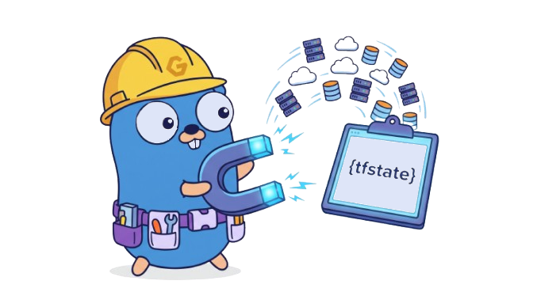

# tfimport 🚀

<p align="center">
  
</p>

`tfimport` is a Go-based CLI auto-pilot designed to automate the painful process of importing existing infrastructure into a Terraform or OpenTofu state file. 

Instead of manually hunting down the correct `terraform import` string format for every single resource (Is it an ARN? A VPC ID? A namespace/name combo?), you simply write the code that matches your existing infrastructure, generate a plan, and let `tfimport` figure out the rest.

## ✨ Features

- **Multi-Tool Support**: Works seamlessly with `terraform`, `terragrunt`, and `tofu`.
- **Smart ID Deduction**: Understands the provider-specific import formats for hundreds of resources (e.g., AWS, Kubernetes).
- **Offline Capable**: Can parse an existing `terraform show -json` plan file without needing to re-run plans.
- **SDK Lookups**: Uses cloud provider SDKs (like AWS SDK) to look up opaque IDs (like `vpc-xxxxx` or resolving `aws_iam_policy` ARNs from path prefixes) based on tags and attributes known at plan time.
- **Resilient**: Gracefully skips newly created resources and handles rate limiting with built-in configurable delays.

## 📦 Installation

### Arch Linux (AUR)
You can install `tfimport` from the Arch User Repository using your favorite AUR helper (e.g., `yay`, `paru`):
```bash
yay -S tfimport-bin
```

### Debian-based / Ubuntu
Grab the latest `.deb` package from the [Releases](https://github.com/coolapso/tfimport/releases) page and install it:
```bash
# Example for amd64 architecture
wget https://github.com/coolapso/tfimport/releases/latest/download/tfimport_<version>_linux_amd64.deb
sudo dpkg -i tfimport_<version>_linux_amd64.deb
```

### RPM-based (RHEL, Fedora, CentOS)
Grab the latest `.rpm` package from the [Releases](https://github.com/coolapso/tfimport/releases) page and install it:
```bash
# Example for amd64 architecture
wget https://github.com/coolapso/tfimport/releases/latest/download/tfimport_<version>_linux_amd64.rpm
sudo rpm -i tfimport_<version>_linux_amd64.rpm
```

### Go Install ( Linux / macOS / Windows )
If you have Go installed on your system, you can build and install it directly:
```bash
# Install the latest version
go install github.com/coolapso/tfimport@latest

# Or install a specific version
go install github.com/coolapso/tfimport@v0.0.1
```

### Windows
Download the latest Windows `.zip` archive from the [Releases](https://github.com/coolapso/tfimport/releases) page. Extract the `tfimport.exe` binary and move it to a folder that is included in your system's `PATH`.
Alternatively, you can build it from source using the `go install` method above.

### Install Script (macOS / Linux)
You can also use our convenient installation script that automatically detects your OS and architecture, and downloads the correct binary to `/usr/local/bin`:
```bash
curl -sL https://raw.githubusercontent.com/coolapso/tfimport/main/docs/install.sh | sudo bash
```
*(An uninstall script is also available at `docs/uninstall.sh`)*

## 🛠 Usage

1. Write your Terraform/Terragrunt manifests to match the infrastructure that already exists in the cloud.
2. Run `tfimport` and point it to your tool of choice!

```bash
# Using Terragrunt with an existing plan file
tfimport --tg --plan-file .tfimport/tfplan

# Using Terraform
tfimport --terraform

# Using OpenTofu (Default)
tfimport
```

### Flags

- `--tg`: Execute plan and import using Terragrunt.
- `--terraform` / `--tf`: Execute plan and import using Terraform.
- `--plan-file <path>`: Provide a path to an existing plan file to skip the planning phase.
- `--dry-run`: Show import details, only used with `--run-import`.
- `--ignore <patterns>`: Comma-separated list of resource addresses or wildcards to ignore (e.g., `aws_iam_role.*`, `module.new_feature.*`). Can be set multiple times.
- `--run-import`: Import resources directly via the CLI instead of generating an `import.tf` block file.
- `--delay <duration>`: Set a delay between imports to avoid API rate limits and DNS exhaustion when using `--run-import` (e.g., `1s`, `5s`). Defaults to `2s`.

---

## ⚖️ Import Execution

By default, `tfimport` generates a static `import.tf` file containing HCL `import {}` blocks (available in Terraform 1.5+ and OpenTofu). You can opt out of this and run CLI imports sequentially by passing the `--run-import` flag.

### 💡 Resilience & Smart Imports
- **Graceful New Resource Handling:** If `tfimport` attempts to import a resource and the cloud provider returns a "non-existent remote object" error, it intelligently assumes this is a genuinely new resource you want to create (not import). It will gracefully skip it and continue without penalizing you with error timeouts.
- **SDK Lookups:** Uses cloud provider SDKs (like AWS SDK) to look up opaque IDs (like `vpc-xxxxx` or IAM Policy ARNs based on `name_prefix`) using attributes known at plan time.

## 💻 For Developers

`tfimport` is designed to be highly extensible. The core logic (`cmd/root.go`) is completely decoupled from the provider-specific logic. 

All ID deduction logic lives in the `internal/providers/` package. The CLI simply passes the resource type and configuration to `providers.GetImportID(ctx, resourceType, config)`.

### Adding Support for New Providers (🛑 READ THIS FIRST)

Terraform providers (like Azure, GCP, or even AWS) have *hundreds* to *thousands* of resources. Each resource has its own specific string format required for the `terraform import` command.

**DO NOT DO THIS MANUALLY.** It is incredibly tedious and error-prone. 

Instead, we strongly recommend using an **AI Agent** (like Copilot, Cursor, or Claude) to bootstrap new providers. We have built a specialized workflow for this:

1. **Read the AI Guide:** Check out [`AGENTS.md`](AGENTS.md) in the root of the project. This file contains precise instructions for AI agents on how this project is structured.
2. **The Doc Cruncher Trick:** Inside the `scripts/` directory, there is a `doc_cruncher.go` script. You (or your AI agent) can clone the official HashiCorp provider documentation repository (e.g., `terraform-provider-google`) and run the script against the markdown files. The script uses Regex to parse the "Import" sections of the official documentation and automatically generates the entire Go switch statement for thousands of resources in seconds!
3. **Custom Resolvers:** Not all IDs can be statically generated. Some require querying the cloud API (e.g., looking up a VPC ID by its Name tag). For this, the system supports "Custom Resolvers" (e.g., `internal/providers/aws_resolvers.go`). The injected `ProviderContext` allows you to lazy-load cloud SDK clients (like the AWS EC2 client) only when that specific provider's resources are encountered, keeping the core tool completely provider-agnostic. Custom resolvers take precedence over the auto-generated documentation mappings.

### Building Locally

```bash
git clone https://github.com/coolapso/tfimport.git
cd tfimport
go build ./...
go run main.go --help
```
